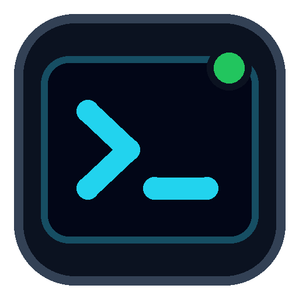
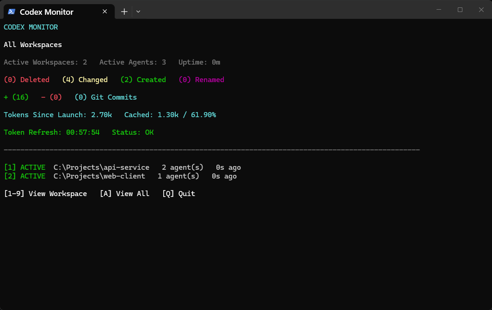
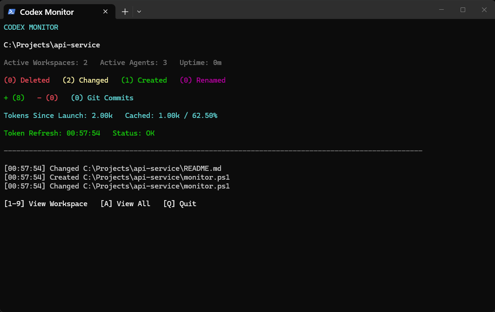

<p align="center">
  
</p>

# Codex Monitor

A lightweight Windows terminal dashboard for observing active Codex CLI workspaces, parallel agents, filesystem mutations, Git changes, commits, and token usage.


## Preview

### All workspaces



### Workspace activity



## Features

- Automatically discovers Codex CLI sessions—no project path configuration.
- Groups parallel agents by working directory.
- Shows an aggregate **All Workspaces** view and individual workspace views.
- Removes a workspace from the active list after all of its sessions have been inactive for two minutes.
- Tracks created, changed, deleted, and renamed filesystem events.
- Tracks Git line additions/removals and commits since discovery.
- Tracks total, input, and cached-token deltas since the monitor launched without decreasing when agents become inactive.
- Shows the last successful token refresh and visible warnings for session-read failures or dropped filesystem events.
- Reads large Codex JSONL logs from the end without loading thousands of earlier records.
- Refreshes from filesystem and Codex session-log events with approximately 100 ms display latency.
- Buffers each dashboard frame so live updates do not blank or flicker while new information is rendered.
- Supports Windows PowerShell 5.1 and PowerShell 7.
- Offers keyboard-only controls and an optional no-color display.

## Run

Open the repository's **Code** menu, choose **Download ZIP**, extract it, and double-click `Start-Codex-Monitor.cmd`. You can also clone it with Git:

```powershell
git clone https://github.com/BrennanNVA/codex-monitor.git
cd codex-monitor
.\Start-Codex-Monitor.cmd
```

Or run the PowerShell entry point directly:

```powershell
powershell.exe -NoProfile -ExecutionPolicy Bypass -File .\src\codex-monitor.ps1
```

No-color mode:

```powershell
.\Start-Codex-Monitor.cmd -NoColor
```

Controls:

```text
[1-9] View Workspace   [A] View All   [Q] Quit
```

## How discovery works

The monitor resolves `CODEX_HOME` when set and otherwise uses `%USERPROFILE%\.codex`. It inspects recently updated JSONL files under the `sessions` directory, reads the session working directory and token-count records, and groups sessions by workspace. New sessions appear automatically. Workspaces disappear when every associated session has been inactive for two minutes.

The active workspace and agent counts include only sessions inside that two-minute activity window. Token counters use each session's first observed values as an in-memory baseline and then accumulate positive deltas for the life of the monitor process. This makes `Tokens Since Launch` stable even after a workspace becomes inactive.

A five-second recovery scan catches rare session-discovery events missed by the operating system watcher; normal updates are event-driven. If a filesystem watcher reports a buffer overflow, the dashboard warns that activity counters may have missed events because those historical events cannot be reconstructed.

## Metrics

- `+ (N)` and `- (N)` are net Git line additions and removals relative to the commit present when the workspace was discovered. Eligible untracked text files are included as additions.
- Git commits are commits made after workspace discovery.
- Tokens since launch are non-negative deltas from the first token counters observed for each session during the current monitor process.
- Cached tokens are cached-input-token deltas and remain a subset of input-token deltas. The adjacent percentage is `cached_input_tokens / input_tokens`, which is the cache-hit rate relevant to input-token cost.
- Token Refresh is the local time of the newest completed session scan.
- `Status: OK` means the newest scan completed without read failures and no watcher has reported dropped events.
- `N/A` means the relevant Git or Codex data is unavailable.

## Privacy

Codex Monitor reads only the minimum local session data needed for discovery and metrics: session ID, working directory, modification time, and token-count records. It does not collect or display prompts, responses, tool arguments, credentials, or source-file contents. Nothing is transmitted by the monitor.

Health warnings contain only sanitized counts and categories; they never include JSONL record bodies or source contents.

## Accessibility

- Keyboard-only operation.
- Labels and symbols accompany every color.
- `-NoColor` mode.
- Responsive path truncation for narrow terminals.
- Stable dashboard rows and explicit unavailable states.

## Limitations

Codex CLI's local JSONL session representation is not a documented public API and may change. The parser is isolated in `src/CodexMonitor.psm1`, preserves the last valid dashboard state, and surfaces read failures rather than silently appearing frozen.

Filesystem event counters are best-effort. Session discovery has a recovery scan, but filesystem events lost during an operating-system watcher overflow cannot be recreated.

## Development

```powershell
Install-Module Pester -MinimumVersion 5.7.1 -Scope CurrentUser -Force
Invoke-Pester .\tests\CodexMonitor.Tests.ps1
```

The canonical icon is `assets/codex-monitor.svg`; PNG and multi-size Windows ICO renderings are included for packaging and shortcuts.

See [CONTRIBUTING.md](CONTRIBUTING.md) and [SECURITY.md](SECURITY.md).
